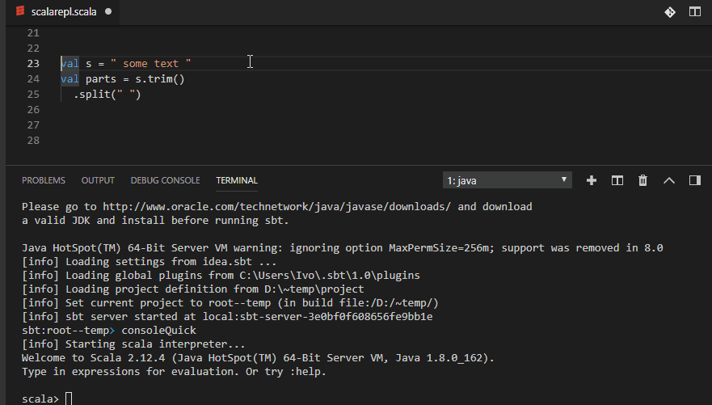

# SendToTerminal+, an extension for `vscode`

Sends text selection to the terminal. Can send multiline statements to the terminal with prefix and postfix that REPLs can determine that the content will be multiline.

## Features

Can send multiline statemenst to `Scala`'s `console` or `spark-shell`.

```
val s = " some text "
val parts = s.trim()
  .split(" ")
```
will be send in `Scala` file as:
* Prefix:
```
:paste
```
* Selection
```
val s = " some text "
val parts = s.trim()
  .split(" ")
```
* Suffix:
```
Ctrl+D
```





If no selection is made then it sends current line.

## Shortcut
```
Send selection : Alt + Shift + Enter
```


## Requirements

If you have any requirements or dependencies, add a section describing those and how to install and configure them.

## Extension Settings

Default setting:
```
    "sendtoterminalplus.languages": [
        {
            "langId": "default",
            "shouldSendSelectionPerLines": false,
            "oneLineSelectionPayload": [
                "{selection}"
            ],
            "multiLineSelectionPayload": [
                "{selection}"
            ]
        },
        {
            "langId": "scala",
            "shouldSendSelectionPerLines": true,
            "oneLineSelectionPayload": [
                "{selection}"
            ],
            "multiLineSelectionPayload": [
                ":paste",
                "{selection}",
                "\u0004"
            ]
        }
    ]
```

This can be extended for different languages. Language `default` is used for all undefined languages. `selection` is used as replacement for selected text.

## Known Issues

There is no vscode API for extensions to determine which terminal is active. Extension therefore picks up the last opened terminal and remembers it to  sends each time the payload to the terminal until the terminal is closed. In case there is no terminal open it creates new terminal which it uses for sending. 

There is `activeTerminal` API already implemented in the `proposed-api` feature set. It will replace current workaround as soon as the API become stable and will be included in the RTM.

## Release Notes


### 0.0.1

Initial release.


-----------------------------------------------------------------------------------------------------------

